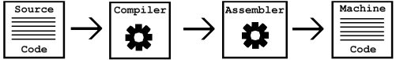

**A:** A Note on Software {#a-a-note-on-software .unnumbered}
=========================

关于软件的基础知识
================

> Copyright © 2002 Richard E.Buckman and Joshua Gay. 此文最早发布于 2002 年。

由 Richard E. Buckman 和 Joshua Gay 撰写

This section is intended for people who have little or no knowledge of
the technical aspects of computer science. It is not necessary to read
this section to understand the essays and speeches presented in this
book; however, it may be helpful to those readers not familiar with some
of the jargon that comes with programming and computer science.

此文面向那些对计算机科学技术方面没有什么知识的人。为了理解书中的文章和演讲，其实不需要阅读此文，不过对不熟悉编程和计算机的人来说，此文可以帮助理解一些术语。

A computer *programmer* writes software, or computer programs. A program
is more or less a recipe with *commands* to tell the computer what to do
in order to carry out certain tasks. You are more than likely familiar
with many different programs: your Web browser, your word processor,
your email client, and the like.

计算机*程序员*写程序或及计算机程序。而程序可以认为是告诉计算机如何完成特定任务的一系列*指令*。这样就构成了你熟悉的不同软件：网页浏览器、文字处理器和邮件客户端等等皆是如此。

A program usually starts out as *source code*. This higher-level set of
commands is written in a *programming language* such as C or Java. After
that, a tool known as a *compiler* translates this to a lower-level
language known as *assembly language*. Another tool known as an
*assembler* breaks the assembly code down to the final stage of *machine
language*—the lowest level—which the computer understands *natively*.

而程序常常是从*源代码*开始。这是一系列高级指令写成的*编程语言*，比如 C 或者 Java。之后会使用一个称为*编译器*的工具将代码编译为底层的*汇编语言*。另一个工具叫做*汇编器*会将汇编代码转成最终阶段的*机器码*——计算机可以*原生*理解的最底层代码。



For example, consider the “hello world” program, a common first program
for people learning C, which (when compiled and executed) prints “Hello
World!” on the screen. [(1)](#FOOT1)

例如，“Hello World”这个程序，比如学习 C 语言时的第一个程序，编译和执行后会在屏幕上打印“Hello World”[^1]。

```C
int main(){
	printf(''Hello World!'');
    return 0;
} 
```

In the Java programming language the same program would be written like
this:

而 Java 语言，同样的程序会是这样：

```Java
public class hello {
	public static void main(String args[]) {
		System.out.println(''Hello World!'');
    }
} 
``` 

However, in machine language, a small section of it may look similar to
this:

而机器码，同样一段程序最终会变成相似的这种：

```
1100011110111010100101001001001010101110
0110101010011000001111001011010101111101
0100111111111110010110110000000010100100
0100100001100101011011000110110001101111
0010000001010111011011110111001001101100
0110010000100001010000100110111101101111
```

The above form of machine language is the most basic representation
known as binary. All data in computers is made up of a series of 0-or-1
values, but a person would have much difficulty understanding the data.
To make a simple change to the binary, one would have to have an
intimate knowledge of how a particular computer interprets the machine
language. This could be feasible for small programs like the above
examples, but any interesting program would involve an exhausting effort
to make simple changes.

上面这段机器码就是基本的二进制形式。所有机器数据都是由 0 或 1 组成的，然而人类很难理解这种数据。为了更容易修改二进制的值，需要对如何编译二进制成竹在胸，这对像上面这种小程序还可以，然而大程序就需要花费大量努力来做很小的修改了。

As an example, imagine that we wanted to make a change to our “Hello
World” program written in C so that instead of printing “Hello World” in
English it prints it in French. The change would be simple; here is the
new program:

比如说，假设让 C 语言的“Hello World”程序输出的英语“Hello World”变成法语。只需要很简单的修改即可：

```C
int main() {
    printf(''Bonjour, monde!'');
    return 0; 
}
```

It is safe to say that one can easily infer how to change the program
written in the Java programming language in the same way. However, even
many programmers would not know where to begin if they wanted to change
the binary representation. When we say “source code,” we do not mean
machine language that only computers can understand—we are speaking of
higher-level languages such as C and Java. A few other popular
programming languages are C++, Perl, and Python. Some are harder than
others to understand and program in, but they are all much easier to
work with compared to the intricate machine language they get turned
into after the programs are compiled and assembled.

因此同样也知道如何修改 Java 里面的这段代码了。然而更多的程序员不懂如何修改二进制形式。当我们说“源代码”的时候，不是指只有机器可以理解的机器码——我们指的是高级语言代码比如 C 或 Java 这种。其他的比如 C++、Perl 和 Python。有些比其他更难理解或编程，但都比理解编译和汇编以后的机器码简单多了。

Another important concept is understanding what an *operating system*
is. An operating system is the software that handles input and output,
memory allocation, and task scheduling. Generally one considers common
or useful programs such as the *Graphical User Interface* (GUI) to be a
part of the operating system. The GNU/Linux operating system contains a
both GNU and non-GNU software, and a *kernel* called *Linux*. The kernel
handles low-level tasks that applications depend upon such as
input/output and task scheduling. The GNU software comprises much of the
rest of the operating system, including GCC, a general-purpose compiler
for many languages; GNU Emacs, an extensible text editor with many, many
features; GNOME, the GNU desktop; GNU libc, a library that all programs
other than the kernel must use in order to communicate with the kernel;
and Bash, the GNU command interpreter that reads your command lines.
Many of these programs were pioneered by Richard Stallman early on in
the GNU Project and come with any modern GNU/Linux operating system.

另一个重要概念是理解*操作系统*。操作系统是控制输入输出，内存分配和任务调度的软件。而通常来说更有用的程序比如*图形用户界面*（*Graphical User Interface*，GUI）也是操作系统的一部分。GNU/Linux 包括了 GNU 和非 GNU 的软件，以及一个称为*Linux*的*内核*。内核负责处理底层任务比如输入输出和任务调度。GNU 软件包含了操作系统其余的大部分，比如 GCC，一个支持多种语言的通用编译器；GNU Emacs，一个可扩展的有很多很多特性的文本编辑器；GNOME，一个 GNU 桌面；GNU libc，除了内核以外，所有其他程序都需要与内核通讯的库；以及 Bash，GNU 命令行解释器可以读取你的命令。很多这些程序早期由理查德·斯托曼在 GNU 工程里开发，并成为现代 GNU/Linux 操作系统的组成部分。

It is important to understand that even if *you* cannot change the
source code for a given program, or directly use all these tools, it is
relatively easy to find someone who can. Therefore, by having the source
code to a program you are usually given the power to change, fix,
customize, and learn about a program—this is a power that you do not
have if you are not given the source code. Source code is one of the
requirements that makes a piece of software *free*. The other
requirements will be found along with the philosophy and ideas behind
them in this collection.

重要的是理解即使*你*没有修改一个程序的源代码的能力，也可以直接使用所有工具，这也比找到其他人能改更相对容易。因此，有源代码的程序你就有权力去修改、修复、个性化和学习编程——而如果得不到源代码就没有这些权力。源代码是让一个软件变*自由*的必要条件之一，而其他必要条件可从本书的哲学和理想中找到答案。

### [(1)](#DOCF1)

In other programming languages, such as Scheme, the *Hello World*
program is usually not your first program. In Scheme you often start
with a program like this:

其他编程语言，比如 Scheme，Hello World 程序并非你的第一个程序。在 Scheme，你通常会从这样的程序开始：

```lisp
(define (factorial n) 
  (if (= n 0) 
      1
      (* n (factorial (- n 1)))))
```

This computes the factorial of a number; that is, running
`(factorial 5)`would output 120, which is computed by doing 5 \* 4 \* 3
\* 2 \* 1 \* 1.

这段程序是求一个数的阶乘；也就是运行`(factorial 5)`将会输出 120，即 5 乘以 4 乘以 3 乘以 2 乘以 1。
