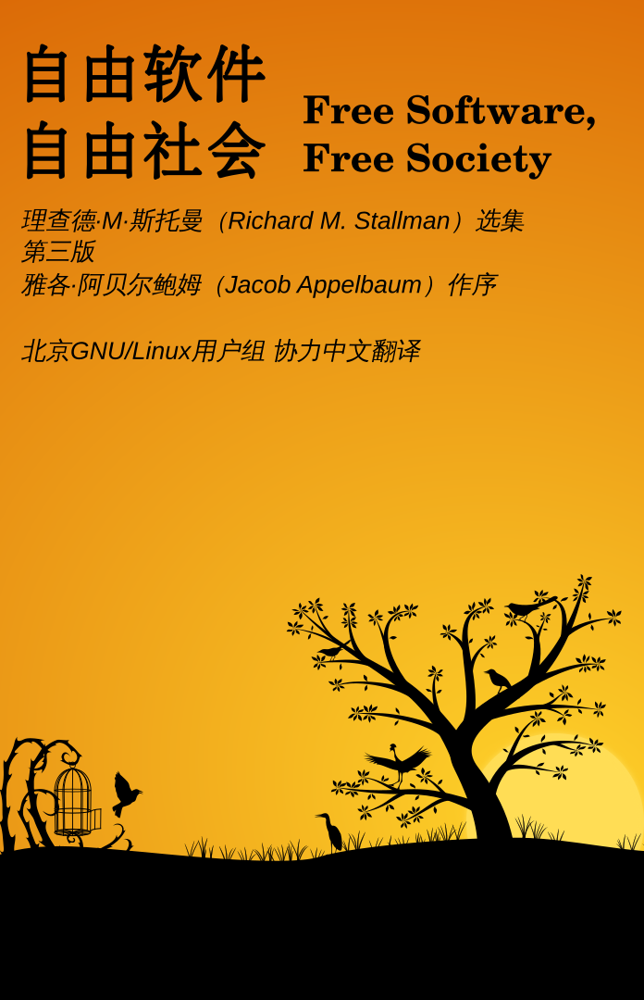

自由软件，自由社会（第三版）
======



封面设计 Kyle Winfree


下载电子版（PDF）：[这里下载](https://github.com/beijinglug/fsfs-zh/releases)

下载电子书（EPUB）：[这里下载](https://github.com/beijinglug/fsfs-zh/releases)

贡献者
-------

感谢以下各位贡献者的辛勤劳动！

| 贡献者 | 贡献内容 |
| ------ | -------- |
| @nadebula | 翻译了第三、四、六和七部分以及其他一些文章 | 
| @tonghuix | 翻译了一些文章，将某些既有翻译加入进来，大量校对 |
| @liushuyu | 翻译了 Linux and GNU 一文 |
| @persmle | 翻译了一些文章，大量校对 | 
| @MandyMY | 大量校对 |
| @biergaizi | 少量翻译 |
| @mytbk | 少量翻译和校对 |


目  录
-----

- [译者序](foreword-trans.md)
- [第三版序言](foreword-v3.md)
- [第一版序言](foreword-v1.md)
- [前言](preface-v3.md)
- 第一部分：GNU 计划和自由软件
    - [什么是自由软件？](free-sw.md)
    - [GNU 公程](thegnuproject.md)
    - [GNU 操作系统的初始公告](initial-announcement.md)
    - [如今自由软件更加重要](free-software-even-more-important.md)
    - [为什么学校应该只使用自由软件](edu-schools.md)
    - [政府推动自由软件的措施](government-free-software.md)
    - [为什么自由软件需要自由的文档](free-doc.md)
    - [售卖自由软件](selling.md)
    - [自由硬件和自由硬件设计](free-hardware-designs.md)
    - [应用自由软件判断准则](applying-free-sw-criteria.md)
- 第二部分：名字的含义
    - [名字的含义？](why-gnu-linux.md)
    - [Linux 和 GNU 操作系统](linux-and-gnu.md)
    - [自由与非自由软件的分类](categories.md)
    - [为什么说开源漏掉了自由软件的要点](open-source-misses-the-point.md)
    - [您说过“知识产权”吗？这是一种迷惑性的幻景](not-ipr.md)
    - [为何称之为诈骗（Swindle）？](why-call-it-the-swindle.md)
    - [应避免使用（或慎用）的词语，由于它们是不公正的或者引起混淆的](words-to-avoid.md)
- 第三部分：版权和不公
    - [阅读的权利](right-to-read.md)
    - [对版权的错误解读——一系列错误](misinterpreting-copyright.md)
    - [科学必须摆脱版权束缚](push-copyright-aside.md)
    - [计算机网络时代的版权与社区之争](copyright-vs-community.md)
- 第四部分：软件专利：对程序员的威胁
    - [软件专利和文学专利](software-literary-patents.md)
    - [软件专利的威胁](danger-of-software-patents.md)
    - [保护软件领域免受专利困扰](limit-patent-effect.md)
- 第五部分：自由软件许可证
    - [许可证简介](licenses-introduction.md)
    - [如何为你的作品选择一份许可证](license-recommendations.md)
    - [X Window 系统的陷阱](x.md)
    - [程序不得限制它们的自由运行](programs-must-not-limit-freedom-to-run.md)
    - [什么是 Copyleft？](copyleft.md)
    - [为什么使用 Copyleft？](why-copyleft.md)
    - [Copyleft：务实的理想主义](pragmatic.md)
    - [GNU 通用公共许可证](gpl.md)
    - [为何升级到 GPLv3](rms-why-gplv3.md)
    - [GNU 宽通用许可证](lgpl.md)
    - [GNU 自由文档许可证](fdl.md)
    - [关于出售例外对 GNU GPL 的影响](selling-exceptions.md)
- 第六部分：陷阱和挑战
    - [您能够信任您的计算机吗？](can-you-trust.md)
    - [JavaScript 陷阱](javascript-trap.md)
    - [如果您在大学工作，请发布自由软件](university.md)
    - [GNU/Linux 上带有数字限制管理（DRM）的私有游戏：是好是坏？](nonfree-games.md)
    - [电子书的威胁](the-danger-of-ebooks.md)
    - [电子书必须增进我们的自由而非限制我们的自由](ebooks-must-increase-freedom.md)
    - [服务器真正是在为谁服务？](who-does-that-server-really-serve.md)
- 第七部分：珍视社区和你的自由
    - [避免破坏性的妥协](compromise.md)
    - [克服社会惯性](social-inertia.md)
    - [自由还是权力？](freedom-or-power.md)
    - [缺陷并不等同于压迫](imperfection-isnt-oppression.md)
    - [民主可以承受多少监控？](surveillance-vs-democracy.md)
- [**附录 A：**关于软件的基础知识](appendix-a.md)
- [**附录 B：**不同语言对“自由软件”和“免费软件”的翻译](appendix-b.md)
- [**附录 C：**自由软件之歌](appendix-c.md)

> Verbatim copying and distribution of this entire book are permitted 
> worldwide, without royalty, in any medium, provided this notice is
> preserved. Permission is granted to copy and distribute translations
> of this book from the original English into another language provided
> the translation has been approved by the Free Software Foundation and
> the copyright notice and this permission notice are preserved on all
> copies.

* * *
````
 Free Software Foundation
 51 Franklin Street, Fifth Floor
 Boston, MA 02110-1335
 Copyright © 2002, 2010, 2015 Free Software Foundation, Inc.
````

ISBN 978-0-9831592-5-4
